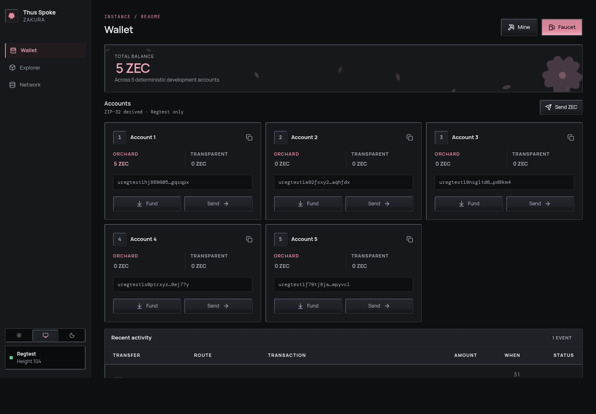
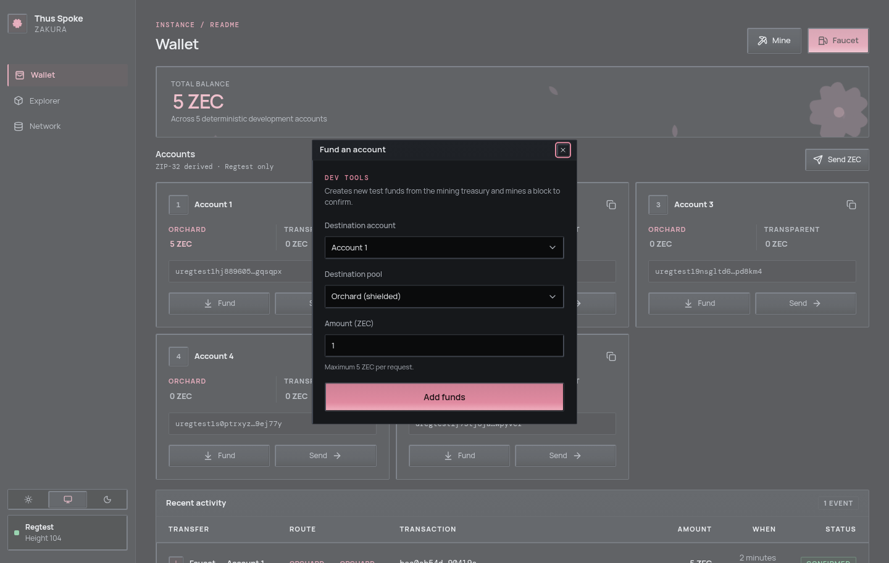
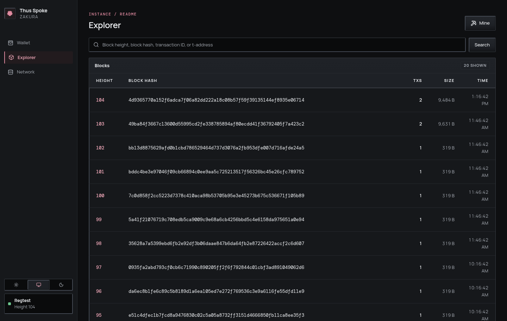
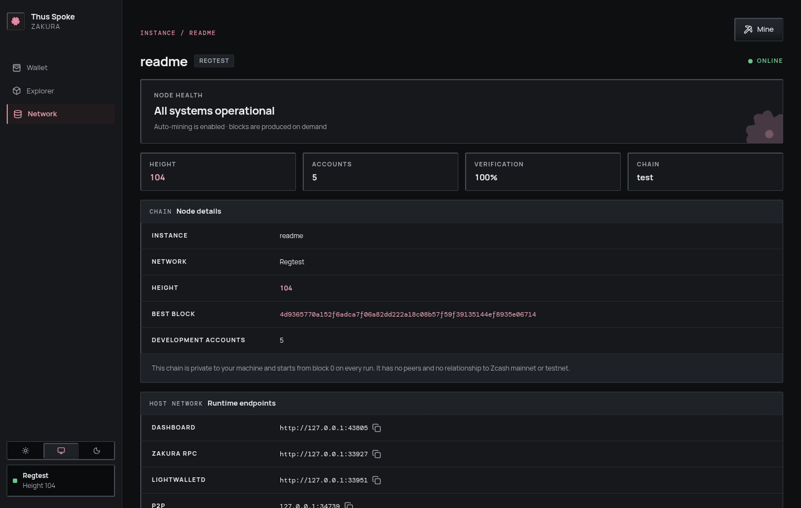

# Thus Spoke Zakura 🌸

Run a complete, private Zcash development network on your computer.

Thus Spoke Zakura starts everything you need for local experiments:

- a Zakura node on Regtest;
- five disposable development accounts;
- a faucet for creating test ZEC;
- automatic mining;
- lightwalletd and JSON-RPC endpoints; and
- a browser wallet, block explorer, and network dashboard.

Nothing connects to Zcash mainnet or testnet. Every run begins with a fresh
chain, and pressing Ctrl+C deletes the containers and development data.



## Get started

### 1. Install Docker Desktop

Install [Docker Desktop](https://www.docker.com/products/docker-desktop/) on
macOS or Linux, then check that Docker is running:

```console
docker version
```

Both the `Client` and `Server` sections should appear without `sudo`.

### 2. Install Thus Spoke Zakura

```console
curl --proto '=https' --tlsv1.2 -fsSL https://raw.githubusercontent.com/zcashlabs/thus-spoke-zakura/main/install.sh | sh
```

The installer supports Linux and macOS on Intel and ARM. It verifies the
download and pulls the matching runtime images. The installed command is `ths`.

### 3. Start it

```console
ths
```

The first start can take a little longer while Docker prepares the images.
When the environment is ready, the dashboard opens automatically.

Keep this terminal open. Press Ctrl+C when you are finished; the launcher will
stop the environment and delete its chain, wallets, keys, volumes, and
containers.

## What can I do?

### Create test funds

Open **Wallet**, select **Faucet**, choose an account and amount, and select
**Add funds**. The faucet creates disposable Regtest ZEC and mines the block
needed to confirm it.



Faucet requests are limited to 5 ZEC. These coins have no value and work only
inside this local environment.

### Send ZEC between accounts

Select **Send ZEC** or the **Send** button on an account card. Choose the source
account, destination account, pool, and amount. The resulting transaction is
mined automatically and appears under **Recent activity**.

You can use Orchard or transparent balances to exercise different transaction
routes.


### Mine blocks

Select **Mine** from any dashboard page and enter the number of blocks. This is
useful when testing confirmations, expiry, coinbase maturity, or code that
reacts to new blocks.


### Explore blocks and transactions

The **Explorer** lists recent blocks. Search by block height, block hash,
transaction ID, or transparent address, then open an item to inspect its
details.



### Connect your own application

The **Network** page shows the live dashboard, Zakura RPC, lightwalletd, and P2P
addresses. Ports are selected automatically and bound only to `127.0.0.1`.



You can also print these values in a terminal:

```console
ths endpoints
ths endpoints --json
```

Run these commands in a second terminal while the environment is running.

## Useful commands

Running `ths` with no command starts the default environment.

| Command | What it does |
| --- | --- |
| `ths` | Start a fresh environment and open the dashboard |
| `ths start --no-open` | Start without opening a browser |
| `ths status` | Show health and endpoint information |
| `ths open` | Open the running dashboard |
| `ths endpoints --json` | Print endpoints for scripts and developer tools |
| `ths mine 10` | Mine blocks on the running environment and synchronize its wallet |
| `ths faucet <ADDRESS>` | Send 1 disposable ZEC to a Regtest unified or transparent address |
| `ths faucet <ADDRESS> --amount 2.5` | Send a custom amount of up to 5 disposable ZEC |
| `ths logs app -f` | Follow dashboard/server logs |
| `ths logs zakura -f` | Follow node logs |
| `ths logs lightwalletd -f` | Follow lightwalletd logs |
| `ths logs --tail 200 -f` | Print the last 200 app log lines, then follow |
| `ths logs zakura --head 200` | Print the first 200 node log lines |
| `ths list` | List known environments |
| `ths stop` | Stop and delete the environment |
| `ths reset --force` | Force-delete one environment and all its data |
| `ths doctor` | Check Docker and local configuration |
| `ths pull` | Pull the exact images for this launcher version |
| `ths update --check` | Check for a newer release |
| `ths update` | Install the latest verified release |
| `ths uninstall` | Remove the installed launcher executable |

Every command accepts `--name` for isolated environments:

```console
ths --name alice
ths --name bob
ths --name alice mine 10
ths mine 10 --name alice
```

Each named environment gets its own ports and Docker resources. Run each one in
a separate terminal.

## Develop from source

You need Rust 1.98, Node 24, and Docker.

First install the web dependencies and build development runtime images:

```console
cd web
npm ci
cd ..
cargo run -p thus-spoke-zakura -- build --dev
```

Then run the launcher directly from the checkout:

```console
cargo run -p thus-spoke-zakura
```

Image building and starting are deliberately separate. After changing the
server or web app, rerun `build --dev`; the next start uses that new local
image. Use `build` without `--dev` to create release-optimized images.

Run the test suite with:

```console
cargo test --workspace
npm run lint --prefix web
npm test --prefix web
npm run build --prefix web
```

### Activity-recovery integration test

The `activity-recovery` CI job runs the real recovery regression on Linux for
every push and pull request. It is separate from the normal Rust and web jobs:
`cargo test --workspace` is Docker-free and cannot establish that this live
scenario works.

Run the following from the repository root. It requires Rust 1.98.0, a running
Docker daemon, network access to pull `zakuracore/zakura:1.4.0`, and enough
local CPU, memory, and time to build the existing pinned lightwalletd image and
create a real Orchard proof. The Rust Cargo integration target is the only test
runner: the normal Cargo invocation runs Docker-free helper tests while the
live test remains ignored until explicitly selected. The node and lightwalletd
remain real external services for that explicit invocation.

```console
cargo test --locked --profile dev-runtime -p tsz-server --test activity_recovery --no-run
cargo test --locked --profile dev-runtime -p tsz-server --test activity_recovery
# The preceding command runs helper tests; the live test remains ignored.
docker pull zakuracore/zakura:1.4.0
docker build -f docker/lightwalletd.Dockerfile -t tsz-recovery-lightwalletd:local .
cargo test --locked --profile dev-runtime -p tsz-server --test activity_recovery -- --ignored --exact broadcast_recovers_after_auto_mine_failure
```

The first command compiles the integration target. The second runs its
Docker-free helper coverage and leaves the ignored live regression unexecuted.
The last command explicitly selects the live regression; Cargo supplies that
target with the matching source-built `tsz-server` binary, including when
`CARGO_TARGET_DIR` is set. Do not substitute an installed or older binary.

The live test owns a UUID-prefixed `tsz-recovery-*` Docker network, containers,
and volumes, plus private temporary data/configuration directories, a local RPC
proxy, and a local server process. It sends a genuine 1,000,000-zatoshi (0.01
ZEC) Orchard payment from Account 1 to Account 2, deliberately rejects exactly
one automatic `generate([1])` through the proxy, mines directly through the
node, then waits for the production background wallet-sync loop to update the
existing activity row. Direct mining is intentional: retrying Send or using the
server's mine endpoint would repair the row through a different path and would
not prove background recovery.

This is an integration test, not a mocked proof: image pull/build, wallet
startup, and Orchard proving make it materially slower and more resource-
intensive than the helper suite. Its fixture removes only exact resources it
registered, stops and reaps its child server, shuts down the proxy, and returns
nonzero for a timeout or cleanup failure. It never prunes shared Docker state.
It suppresses server process output and does not upload raw process logs,
request bodies, wallet keys, wallet databases, or configuration directories.

To prove the regression is sensitive, perform the negative control only after a
successful live run and only in an isolated verification worktree. Temporarily
remove `reconcile_unconfirmed(self).await?;` from
`AppState::refresh_wallet_snapshot`, rerun the same explicit live Cargo command,
and require failure at background activity recovery after the broadcast,
intercepted auto-mine failure, and real inclusion checks. Restore the exact line
immediately, including after a failed run; do not retain the temporary
production-code edit.

## How it fits together

```text
Browser ──HTTP/SSE── tsz-server ──JSON-RPC── Zakura (Regtest)
                         │                       │
                         └──────gRPC──── lightwalletd
```

The server owns wallet synchronization and exposes the latest confirmed wallet
snapshot to the dashboard. A hidden sixth account acts as the mining and faucet
treasury. Account 1 starts with 5 Orchard ZEC, so you can experiment immediately.

The launcher chooses exact versioned images, labels every Docker resource by
instance, and never binds a service beyond loopback.

> [!WARNING]
> This project is for Regtest development only. Never send real funds to an
> address generated by Thus Spoke Zakura.

## Troubleshooting

**Docker permission denied on Linux**

```console
sudo usermod -aG docker "$USER"
```

Log out of your desktop session completely, log back in, and verify that `id`
includes the `docker` group. Docker group membership grants root-equivalent
access, so use it only for trusted users.

**The dashboard did not open**

```console
ths open
```

Or copy the Dashboard URL printed by the launcher.

**A service is unhealthy**

```console
ths status
ths logs app
ths logs zakura
ths logs lightwalletd
```

**Start over completely**

```console
ths reset --force
```

This permanently deletes that instance's development data.

**Uninstall the launcher**

Stop any running environment with Ctrl+C, then run:

```console
ths uninstall
```

This removes only the installed `ths` executable. Cached Docker images and the
small launcher configuration directory remain available for a later reinstall.

## Releases

Release binaries and checksums are available on the
[GitHub Releases page](https://github.com/zcashlabs/thus-spoke-zakura/releases).
Maintainer instructions live in [RELEASING.md](RELEASING.md).

## License

MIT
