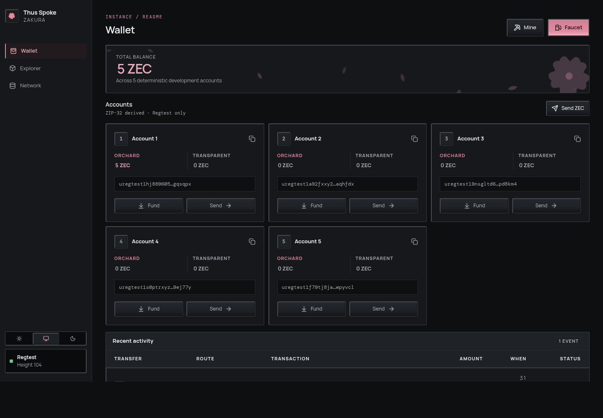
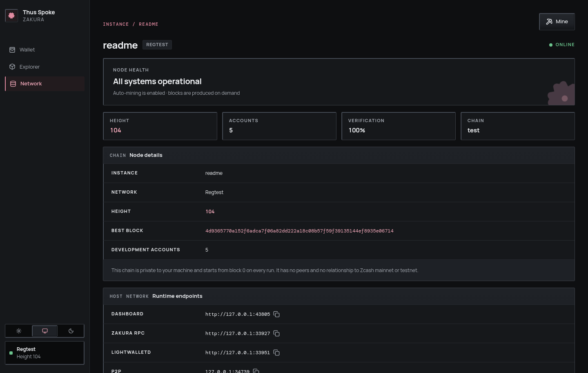

# Thus Spoke Zakura 🌸

Run a complete, private Zcash development network on your computer.

Thus Spoke Zakura starts everything you need for local experiments:

- a Zakura node on Regtest;
- five disposable development accounts;
- a faucet for creating test ZEC;
- automatic mining;
- lightwalletd and JSON-RPC endpoints; and
- a browser wallet, block explorer, and network dashboard.

Nothing connects to Zcash mainnet or testnet. Every run begins with a fresh
chain, and pressing Ctrl+C deletes the containers and development data.



## Get started

### 1. Install Docker Desktop

Install [Docker Desktop](https://www.docker.com/products/docker-desktop/) on
macOS or Linux, then check that Docker is running:

```console
docker version
```

Both the `Client` and `Server` sections should appear without `sudo`.

### 2. Install Thus Spoke Zakura

```console
curl --proto '=https' --tlsv1.2 -fsSL https://raw.githubusercontent.com/zcashlabs/thus-spoke-zakura/main/install.sh | sh
```

The installer supports Linux and macOS on Intel and ARM. It verifies the
download and pulls the matching runtime images. The installed command is `ths`.

### 3. Start it

```console
ths
```

The first start can take a little longer while Docker prepares the images.
When the environment is ready, the dashboard opens automatically.

Keep this terminal open. Press Ctrl+C when you are finished; the launcher will
stop the environment and delete its chain, wallets, keys, volumes, and
containers.

## What can I do?

### Create test funds

Open **Wallet**, select **Faucet**, choose an account and amount, and select
**Add funds**. The faucet creates disposable Regtest ZEC and mines the block
needed to confirm it.


Faucet requests are limited to 5 ZEC. These coins have no value and work only
inside this local environment.

From a terminal, fund several accounts at once by index:

```console
ths wallet faucet --accounts 1,2,3 --amount 3
```

### Send ZEC between accounts

Select **Send ZEC** or the **Send** button on an account card. Choose the source
account, destination account, pool, and amount. The resulting transaction is
mined automatically and appears under **Recent activity**.

You can use Ironwood or transparent balances to exercise different transaction
routes.

When the destination pool is Ironwood, you can add an optional memo of up to
512 bytes. It is encrypted to the recipient and never shown in the explorer.
Transparent outputs cannot carry a memo, so the field is disabled for them.


The same transfer from a terminal:

```console
ths wallet send --from 1 --to 2 --amount 1 --memo "rent for October"
```

### Mine blocks

Select **Mine** from any dashboard page and enter the number of blocks. This is
useful when testing confirmations, expiry, coinbase maturity, or code that
reacts to new blocks.

Mining runs in the server. You can dismiss the dialog, navigate to another page,
refresh, or close the tab while it runs. The dashboard restores the latest job
and its confirmed progress when you return. Only one manual job can run at a
time, including wallet synchronization. Payment and faucet confirmation mining
can interleave; those blocks do not count toward the manual request.

Progress counts hashes acknowledged for this job. If a mining RPC fails, extra
blocks may have committed without a usable response. The dashboard then shows a
lower-bound count and uncertain progress; the server never automatically retries
that RPC. A wallet synchronization failure after mining reports the full mined
count separately from the synchronization error.

The dashboard uses these job endpoints:

| Endpoint | Behavior |
| --- | --- |
| `POST /api/v1/mining/jobs` | Accept `{blocks, idempotency_key}` and return the job with HTTP 202 |
| `GET /api/v1/mining/jobs` | Return `{job}` for the latest job, or `{job: null}` |
| `GET /api/v1/mining/jobs/{id}` | Return a retained job, or HTTP 404 |

Reusing an accepted key with the same block count returns the same job. A changed
count for that key or a different request during an active manual job returns
HTTP 409. The server retains at most 1,024 jobs and their keys for its process
lifetime. At capacity, it rejects new admissions with HTTP 503 while reads and
existing-key replays remain available. Stopping the server cancels running work
and discards the history; jobs are not recovered after restart.

`ths mine` still waits for the server-owned job and wallet synchronization before
reporting success. Its HTTP client times out after 300 seconds, but an admitted
job continues after that timeout or a client disconnection. Inspect the latest
job before issuing another command. Each legacy request uses a fresh internal
key, so repeating a command after completion starts another job.


### Explore blocks and transactions

The **Explorer** lists recent blocks. Search by block height, block hash,
transaction ID, or transparent address, then open an item to inspect its
details.


### Connect your own application

The default instance always binds loopback ports:

| Service | URL |
| --- | --- |
| Dashboard | `http://127.0.0.1:32805` |
| Zakura RPC | `http://127.0.0.1:18232` |
| lightwalletd | `http://127.0.0.1:9067` (Regtest, no TLS) |
| P2P | `127.0.0.1:18233` |

If a port is already taken, `ths start` exits and names that port. It does not pick a random host port.



```console
ths endpoints
ths endpoints --json
```

`endpoints --json` includes `"network": "regtest"` and `"tls": false` for lightwalletd.

### Use the development accounts

Every environment derives its accounts from the same mnemonic, so the account
addresses are the same on every run. The mnemonic is public; never send real
funds to these accounts.

```text
abandon abandon abandon abandon abandon abandon abandon abandon abandon abandon abandon abandon abandon abandon abandon abandon abandon abandon abandon abandon abandon abandon abandon art
```

| Account | Transparent address |
| --- | --- |
| 1 | `tmBsTi2xWTjUdEXnuTceL7fecEQKeWaPDJd` |
| 2 | `tmF3CKFqQ68GdisHK3D9S8pMty7a7Fr2wiN` |
| 3 | `tmRmiMusmfipcUmWeQ4YUVc6rKtckdd2aV3` |
| 4 | `tmDGByq79K3SJdCt3aGCTjYquv45Nf3ExaL` |
| 5 | `tmAsyD1UHXiomo6na1z7b1UtMSpFJArgPv9` |

Unified addresses:

```text
Account 1: uregtest1zkuzfv5m3yhv2j4fmvq5rjurkxenxyq8r7h4daun2zkznrjaa8ra8asgdm8wwgwjvlwwrxx7347r8w0ee6dqyw4rufw4wg9djwcr6frzkezmdw6dud3wsm99eany5r8wgsctlxquu009nzd6hsme2tcsk0v3sgjvxa70er7h27z5epr67p5q767s2z5gt88paru56mxpm6pwz0cu35m
Account 2: uregtest1fglg8gvt5luptyqvrx0u52yam4cru63skg9s0sa6zth72hachgyhwm8e7p9vy2vcatws7wvzfhnrqte4nwrff7tju4dv35gdn4h8ekarqyeqlk5gpmm5zlphzls960xe20cajd0k4vcvm2j8sekz77f864sgedncru8u8ruz8gvnpuxvnk7qcyszj7jg5n7nqqqfswh736c2kt4s7ad
Account 3: uregtest1m3cll7nlzq6dyrgpfvw22xcrvkq4x4y79q6wekj9t24dh6khunpu0gw7u80tlz047gwmr54qvhllq4ad4vm5qrxjlr997l3egt4scs3fg578stzue3u68rte0y76gy43kmvgvaj0jcmkewpa86w9ml2ph2wg9cd2mnwr272y8eggtvhsrxeeykx04hksanha3qmvhrf0v2c52fxyaue
Account 4: uregtest1549x97unhklahphm9rzvf9dl6fm8nnpw8upggjnet7090sf994wm8crdnv8ul4h4jwy07hdt9ns59307um2gqzzpfssphtwjj4053ykgc4w2kczq4u9gxg9t08eg8d7gj90wp84v34wyurfhvu4zpmrkl9le2m04jcletuwvwa52a9fj90v3wulh32yhldr84uwr4j47z3w55w2899r
Account 5: uregtest1l82ktar6wygqsncxp7famz8manh48tv283pve29fnumsrskyj9dyhn50l9gntm9k524cjq5xxm0zr7qwsspcmtrm5jlc7tqww60p9uvd8dke3sah86yzkj4rakhkpp0um6n08dxg50jv4pxnf3stenmyeyzqm0746g87sjh6kd328d0jetnwgktkuhjsfnhca5s9stselz02q52zvcj
```

## Useful commands

Running `ths` with no command starts the default environment.

| Command | What it does |
| --- | --- |
| `ths` | Start a fresh environment and open the dashboard |
| `ths start --no-open` | Start without opening a browser |
| `ths start --port-offset 10` | Start on loopback ports shifted by 10 for another instance |
| `ths status` | Show health and endpoint information |
| `ths open` | Open the running dashboard |
| `ths endpoints --json` | Print endpoints for scripts and developer tools |
| `ths mine 10` | Mine blocks on the running environment and synchronize its wallet |
| `ths faucet <ADDRESS>` | Send 1 disposable ZEC to a Regtest unified or transparent address |
| `ths faucet <ADDRESS> --amount 2.5` | Send a custom amount of up to 5 disposable ZEC |
| `ths wallet faucet --accounts 1,2,3 --amount 3` | Fund development accounts by index from the treasury |
| `ths wallet send --from 1 --to 2 --amount 1 --memo "hi"` | Send between development accounts or pools, with an optional Ironwood memo |
| `ths wallet shield --from 1 --to 2 --amount 0.5` | Spend transparent funds into the same or another account's Ironwood balance |
| `ths wallet unshield --from 1 --to 2 --amount 0.2` | Spend Ironwood funds into the same or another account's transparent balance |
| `ths logs app -f` | Follow dashboard/server logs |
| `ths logs zakura -f` | Follow node logs |
| `ths logs lightwalletd -f` | Follow lightwalletd logs |
| `ths list` | List known environments |
| `ths stop` | Stop and delete the environment |
| `ths reset --force` | Force-delete one environment and all its data |
| `ths doctor` | Check Docker and local configuration |
| `ths pull` | Pull the exact images for this launcher version |
| `ths update --check` | Check for a newer release |
| `ths update` | Install the latest verified release |
| `ths uninstall` | Remove the installed launcher executable |

Everything under `ths wallet` acts on the development wallet held by the
running `ths` server. See [docs/cli.md](docs/cli.md) for the full command
reference, including every `ths wallet` option, memo rules, and more examples.

Every command accepts `--name` for isolated environments:

```console
ths --name alice
ths --name bob
ths --name alice mine 10
ths mine 10 --name alice
```

Each named environment has its own Docker resources. A second instance must
not reuse the default ports:

```console
ths --name alice start --port-offset 10
```

`--port-offset` is a multiple of 10 added to every default host port
(dashboard 32815, RPC 18242, P2P 18243, lightwalletd 9077). If those binds
are taken, start fails rather than remapping.

## Develop from source

You need Rust 1.98, Node 24, and Docker.

First install the web dependencies and build development runtime images:

```console
cd web
npm ci
cd ..
cargo run -p thus-spoke-zakura -- build --dev
```

Then run the launcher directly from the checkout:

```console
cargo run -p thus-spoke-zakura
```

Image building and starting are deliberately separate. After changing the
server or web app, rerun `build --dev`; the next start uses that new local
image. Use `build` without `--dev` to create release-optimized images.

Run the test suite with:

```console
cargo test --workspace
npm run lint --prefix web
npm test --prefix web
npm run build --prefix web
```

### Activity-recovery integration test

The `activity-recovery` CI job runs the real recovery regression on Linux for
every push and pull request. It is separate from the normal Rust and web jobs:
`cargo test --workspace` is Docker-free and cannot establish that this live
scenario works.

Run the following from the repository root. It requires Rust 1.98.0, a running
Docker daemon, network access to pull `zakuracore/zakura:1.6.0`, and enough
local CPU, memory, and time to build the existing pinned lightwalletd image and
create a real Ironwood proof. The Rust Cargo integration target is the only test
runner: the normal Cargo invocation runs Docker-free helper tests while the
live test remains ignored until explicitly selected. The node and lightwalletd
remain real external services for that explicit invocation.

```console
cargo test --locked --profile dev-runtime -p ths-server --test activity_recovery --no-run
cargo test --locked --profile dev-runtime -p ths-server --test activity_recovery
# The preceding command runs helper tests; the live test remains ignored.
docker pull zakuracore/zakura:1.6.0
docker build -f docker/lightwalletd.Dockerfile -t ths-recovery-lightwalletd:local .
cargo test --locked --profile dev-runtime -p ths-server --test activity_recovery -- --ignored --exact broadcast_recovers_after_auto_mine_failure
cargo test --locked --profile dev-runtime -p ths-server --test activity_recovery -- --ignored --exact concurrent_identical_sends_have_one_chain_effect
cargo test --locked --profile dev-runtime -p ths-server --test activity_recovery -- --ignored --exact internal_address_faucets_record_confirmed_activity
cargo test --locked --profile dev-runtime -p ths-server --test activity_recovery -- --ignored --exact internal_address_faucet_recovers_after_auto_mine_failure
cargo test --locked --profile dev-runtime -p ths-server --test activity_recovery -- --ignored --exact external_address_faucet_behavior_is_unchanged
cargo test --locked --profile dev-runtime -p ths-server --test activity_recovery -- --ignored --exact same_account_cross_pool_round_trip_is_replay_safe
```

The first command compiles the integration target. The second runs its
Docker-free helper coverage and leaves the ignored live regression unexecuted.
The remaining Cargo commands explicitly select the live regressions; Cargo supplies that
target with the matching source-built `ths-server` binary, including when
`CARGO_TARGET_DIR` is set. Do not substitute an installed or older binary.

The live test owns a UUID-prefixed `ths-recovery-*` Docker network, containers,
and volumes, plus private temporary data/configuration directories, a local RPC
proxy, and a local server process. It sends a genuine 1,000,000-zatoshi (0.01
ZEC) Ironwood payment from Account 1 to Account 2, deliberately rejects exactly
one automatic `generate([1])` through the proxy, mines directly through the
node, then waits for the production background wallet-sync loop to update the
existing activity row. Direct mining is intentional: retrying Send or using the
server's mine endpoint would repair the row through a different path and would
not prove background recovery.

The same-account round-trip regression unshields 1,000,000 zatoshis from Account 1
to its transparent pool, then shields 500,000 zatoshis back to Ironwood. It checks
exact pool balances, Ironwood change, consumption of the received transparent
output, transaction inclusion, and persisted activity. Replaying each request
with the same idempotency key must leave balances, activity, and the chain tip
unchanged. The exact fee and change expectations belong to this controlled
single-note/single-UTXO fixture and pinned SDK.

This is an integration test, not a mocked proof: image pull/build, wallet
startup, and Ironwood proving make it materially slower and more resource-
intensive than the helper suite. Its fixture removes only exact resources it
registered, stops and reaps its child server, shuts down the proxy, and returns
nonzero for a timeout or cleanup failure. It never prunes shared Docker state.
It suppresses server process output and does not upload raw process logs,
request bodies, wallet keys, wallet databases, or configuration directories.

To prove the regression is sensitive, perform the negative control only after a
successful live run and only in an isolated verification worktree. Temporarily
remove `reconcile_unconfirmed(self).await?;` from
`AppState::refresh_wallet_snapshot`, rerun the same explicit live Cargo command,
and require failure at background activity recovery after the broadcast,
intercepted auto-mine failure, and real inclusion checks. Restore the exact line
immediately, including after a failed run; do not retain the temporary
production-code edit.

## How it fits together

```text
Browser ──HTTP/SSE── ths-server ──JSON-RPC── Zakura (Regtest)
                         │                       │
                         └──────gRPC──── lightwalletd
```

The server owns wallet synchronization and exposes the latest confirmed wallet
snapshot to the dashboard. A hidden sixth account acts as the mining and faucet
treasury. Account 1 starts with 5 Ironwood ZEC, so you can experiment immediately.

The local chain activates every network upgrade through NU6.3 at height 1, so it
follows mainnet's current consensus rules. Shielded funds live in the Ironwood
pool. The Orchard pool stopped accepting deposits at NU6.3, so the wallet API
rejects `orchard` as a pool.

The launcher chooses exact versioned images, labels every Docker resource by
instance, and never binds a service beyond loopback.

> [!WARNING]
> This project is for Regtest development only. Never send real funds to an
> address generated by Thus Spoke Zakura.

## Troubleshooting

**Docker permission denied on Linux**

```console
sudo usermod -aG docker "$USER"
```

Log out of your desktop session completely, log back in, and verify that `id`
includes the `docker` group. Docker group membership grants root-equivalent
access, so use it only for trusted users.

**The dashboard did not open**

```console
ths open
```

Or copy the Dashboard URL printed by the launcher.

**A service is unhealthy**

```console
ths status
ths logs app
ths logs zakura
ths logs lightwalletd
```

**Start over completely**

```console
ths reset --force
```

This permanently deletes that instance's development data.

**Uninstall the launcher**

Stop any running environment with Ctrl+C, then run:

```console
ths uninstall
```

This removes only the installed `ths` executable. Cached Docker images and the
small launcher configuration directory remain available for a later reinstall.

## Releases

Release binaries and checksums are available on the
[GitHub Releases page](https://github.com/zcashlabs/thus-spoke-zakura/releases).
Maintainer instructions live in [RELEASING.md](RELEASING.md).

## License

MIT
