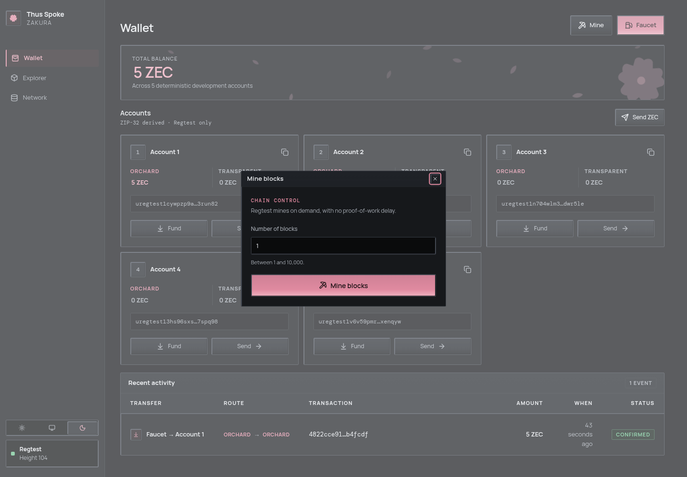

# 5. Mining and wallet sync

You have funded Account 2 and sent a payment. Both operations normally mine
a confirming block for you. This chapter mines explicitly and follows a
block from the node to the wallet and browser.

**Mining** asks Zakura to generate Regtest blocks on demand. A transaction is
**confirmed** when the node reports it in a block on its current chain with
a block hash. That does not instantly make every wallet view current:
lightwalletd still has
to index the block, and the wallet still has to scan and reconcile it.


1. `ths mine N` or the dashboard Mine dialog calls `POST /api/v1/mine` with
   `{"blocks":N}`. The server accepts **1–10,000** blocks.
2. Zakura generates blocks and returns their hashes. The server asks Zakura
   for the last returned block's height.
3. The wallet waits for lightwalletd to index that height, scans compact
   blocks, reconciles against Zakura's canonical block hashes, and publishes
   a fresh user-account snapshot at a matching checkpoint.
4. The server notifies dashboard clients of a `chain` update and returns
   `blocks` and `hashes`. If a step after generation fails, the API returns
   an error even though blocks may already exist.

## Mine and inspect one result

In the second terminal from Chapter 1, mine two blocks:

```console
$ ths mine 2
Mined 2 blocks on default.
New tip: 9ef8f0064e3f088f2012fe04d5d70b42f00ae1e9676cdc3d5384ad31d384b8c4
```

The tip hash differs on every run. Two blocks come back in about a second;
Regtest has no proof-of-work delay, so the wait is wallet scanning, not
mining. The dashboard's **Mine** dialog performs the same API operation.
Do not run both if you intend to add only two blocks.



Read the node and wallet view through the running instance's API:

```console
DASHBOARD_URL="$(ths endpoints --json | python3 -c 'import json,sys; print(json.load(sys.stdin)["dashboard"])')"
curl -fsS "$DASHBOARD_URL/api/v1/status"
curl -fsS "$DASHBOARD_URL/api/v1/accounts"
```

`ths status` reports container status and endpoints, not chain height. In
`GET /api/v1/status`, `node.blocks` is the node height and
`node.bestblockhash` is the tip hash.

One field there will look wrong: `node.chain` reads `"test"`, not
`"regtest"`. That string comes straight from Zakura, which reports Regtest
under its testnet chain name; the Network page's **Chain** tile shows the
same raw value. The instance is Regtest — `status.network` says `Regtest`
and `ths endpoints --json` says `"network": "regtest"`. Ignore `node.chain`
and use either of those.

The wallet fields mean:

| Field | Meaning |
| --- | --- |
| `wallet_sync.state` | `ready`, `syncing`, or `error` for the server's last synchronization attempt. |
| `observed_height` and `observed_hash` | The node checkpoint the server most recently observed. |
| `fully_scanned_height` and `fully_scanned_hash` | The wallet checkpoint it has scanned and validated; these can be null below the wallet birthday. |
| `error` | Why the last attempt failed, if it did. |
| `last_success_at` | Unix time of the last successful snapshot publication. |

After a successful explicit mine on the normal running example, the wallet
has reconciled through the mined tip before the response. An independent
chain change can happen later, so use the current status fields when making
a decision. `GET /api/v1/accounts` serves the **last wallet snapshot**; it
does not calculate balances from `node.blocks`.

## A same-height chain change still matters

A block height is a position; a **block hash** identifies the block at that
position. A **reorganization** replaces one branch of recent blocks with
another. A local chain can reorganize and replace a block with another at
the same height: height `H` may have hash `A`, then hash `B`. The server
compares hashes, finds a common checkpoint,
rewinds its wallet scan when necessary, and scans the canonical chain again.
It publishes balances only after reconciliation succeeds.


1. About every two seconds, the background loop asks Zakura for the current
   checkpoint. A changed height **or hash** starts reconciliation.
2. The wallet checks its scanned chain against Zakura and uses
   lightwalletd's compact blocks to catch up. A mismatch can require a
   rewind and rescan.
3. On success, the server refreshes account balances, marks sync `ready`,
   and notifies dashboard query hooks. On failure it reports `error`;
   the last known balances can remain visible and may be stale.

This is why the Network page, Explorer, Recent activity, and Wallet page can
show different stages of one event. They are observations of different
owners, not four copies of one database. Revisit [the state ownership
diagram](architecture/overview.md#the-five-owners-of-information) if that
distinction is unclear.

**Next:** [learn what to do when a payment or mining response is
uncertain](architecture/operations.md).
