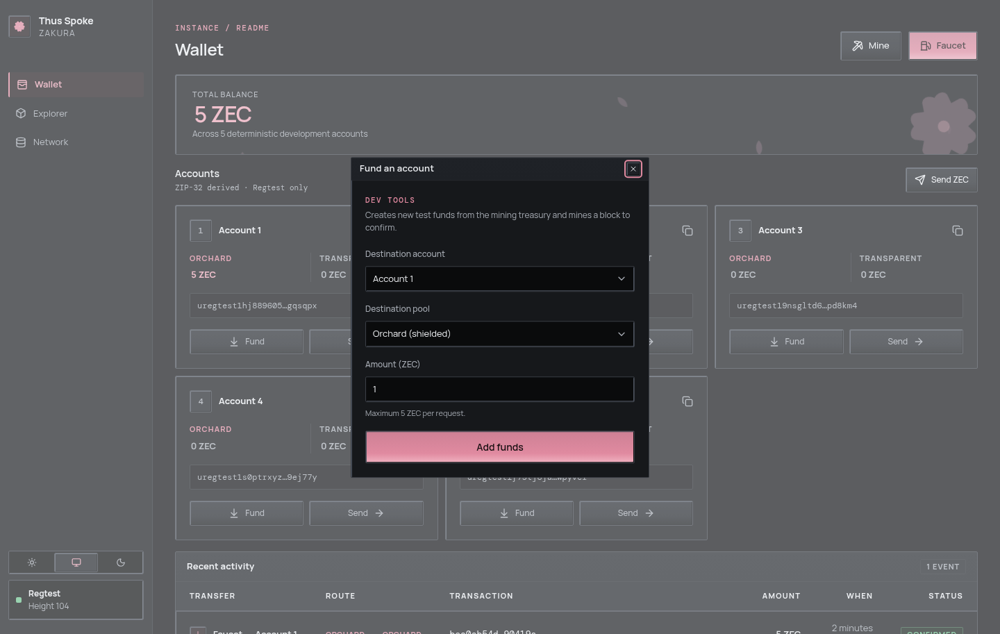
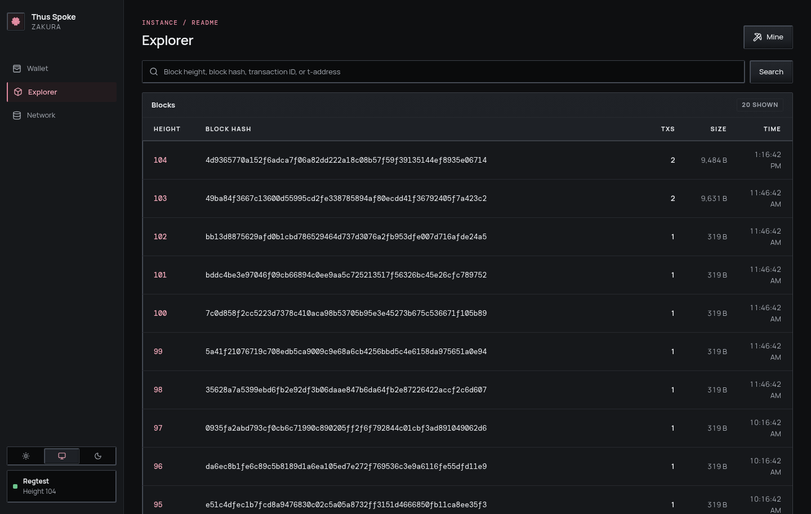

# 4. Fund and send

You now know that an account has two pool balances and that the treasury
funds faucet requests. We will use the `default` instance from Chapter 1 to
make those ideas visible. Keep `ths start --no-open` running in its first
terminal; run commands below in a second terminal. If you stopped it, run
`ths start --no-open` again — you get the same five accounts on a fresh
chain at height 103, which is all this chapter needs.

The dashboard has **Wallet**, **Explorer**, and **Network** pages. Use `ths
open` to bring it up. On desktop, the **Mine** button sits at the top of
each page; on a narrow screen you can always use `ths mine`.

## First, observe the starting state

Open **Wallet**. Account 1 should show **5 Orchard ZEC** after startup;
Account 2 should have no funds. If balances have not appeared, inspect
`GET /api/v1/status` or follow [troubleshooting](troubleshooting.md) before
sending. The server wallet snapshot, not a browser calculation from chain
history, supplies these balances.


Two buttons open the faucet, and they are labelled differently. **Faucet**
in the page header is the general one, and it only appears on Wallet — the
Explorer and Network pages show just **Mine**. On each account card,
**Fund** opens the same dialog with that account preselected.

## Fund Account 2's transparent pool

1. Select **Fund** on Account 2's card, or **Faucet** in the header.
2. In the **Fund an account** dialog, choose **Destination account** 2,
   **Destination pool** Transparent, and **Amount (ZEC)** 1. Select
   **Add funds**.
3. Look at **Recent activity** for the transaction ID (`txid`), the unique
   identifier of the broadcast transaction, and its status. When
   confirmed, Account 2's transparent balance should rise by 1 ZEC; its
   Orchard balance is still separate.



The same operation from the second terminal takes about a second:

```console
$ ths wallet faucet --accounts 2 --amount 1 --pool transparent
Funded account 2 with 1 ZEC (transparent pool) on default.
  Transaction: effa7550e63fe84593d1436c27ba0d5079a819fa12311f4dd5c72e4535e39a75
```

Every transaction and block hash in this book came from one particular run.
Yours will differ; only the shape of the output is the same.

Choose **either** the UI action or the CLI command if you want exactly one
faucet payment. Running both makes two payments. The faucet may mine extra
blocks first to mature and shield treasury rewards, then normally mines one
block to confirm the account payment. It accepts at most 5 ZEC **per account
per request**. If auto-mining fails, the recorded activity may remain
`broadcast`; [Chapter 6](architecture/operations.md) explains that state.

## Send Orchard funds from Account 1 to Account 2

This is a **different** pool movement from the transparent faucet payment.

1. On Wallet, select **Send ZEC**.
2. Set **From account** to 1 and **Source pool** to Orchard. Set
   **Destination account** to 2 and **Destination pool** to Orchard.
3. Enter **1** in **Amount (ZEC)**. Optionally enter `hello from Regtest`
   in **Memo (optional)**, then select **Send ZEC**.
4. Check Recent activity for the transaction ID and actual status. After
   confirmation, Account 2 has 1 Orchard ZEC **and** its earlier 1
   transparent ZEC. Account 1's Orchard balance falls by 1 ZEC **plus the
   fee**; do not expect it to be exactly 4 ZEC.

The dialog does the fee arithmetic for you. As soon as it has an account and
a pool it asks `POST /api/v1/send/quote`, and the hint under the amount field
reads "*N* ZEC spendable after a 0.0001 ZEC network fee" with the real
numbers for that account and pool. The **Max** button fills in that spendable
figure. An amount above it is rejected before anything is built.


CLI equivalent, also about a second:

```console
$ ths wallet send --from 1 --to 2 --amount 1 --memo "hello from Regtest"
Sent 1 ZEC from account 1 (orchard pool) to account 2 (orchard pool) on default.
Memo: hello from Regtest
Transaction: 68eff90854875decad05e9821f05ff3267a8d7c140b87b24edd9e32231e477d4
Confirmed in: df2f5b28f8500c437901f9cc371827fa5c1af0af86247b88b8a481c52b36f919
```

After that faucet payment and this send, the accounts API reported Account 1
at `399990000` Orchard zatoshi and Account 2 at `100000000` transparent plus
`100000000` Orchard. Account 1 is down 1 ZEC **and** a 10,000 zatoshi fee,
exactly as the quote predicted — 3.9999 ZEC, not 4.

Run the UI action **or** the command, not both, for one transaction.
The UI and CLI create a fresh idempotency key for each new submission. A
second click or command is a second attempt, not a replay of the first.


1. **Pair 1 — where the money comes from.** The source account is one of
   1–5, and the source pool decides what is spent: `transparent` spends
   that account's UTXOs, `orchard` spends its shielded notes.
2. **Pair 2 — what the receiver gets.** The destination account is one of
   1–5 and must differ from the source. `orchard` pays its unified address;
   `transparent` pays its t-address.
3. **The fee is on top of the amount**, taken from the source account. That
   is why `max_zatoshi` from the quote, not the balance, is the ceiling.
4. **A transparent source rarely spends exactly.** Transparent inputs must
   be spent whole, so the change comes back as an Orchard note in the source
   account rather than as transparent change.
5. **Only an Orchard destination carries a memo.** A transparent output has
   no memo field at all, and a memo sent with one is rejected.

The memo is encrypted to the recipient and limited to **512 UTF-8 bytes**,
not 512 characters. The UI disables the field for Transparent destinations;
the server rejects a present memo there too.

Be clear about what happens to it afterwards: **this environment cannot show
you a memo again.** Activity rows have no memo column, no API response
carries one, and no page displays one. The memo really is attached to the
Orchard output — it is simply write-only from here. The one way to read it
back is outside this dashboard: `GET /api/v1/accounts` returns a
`unified_full_viewing_key` for each of Accounts 1–5, and a wallet imported
with that key can decrypt the memos sent to that account. The public
Explorer never reveals memo plaintext or Orchard recipient addresses.

## A pool conversion to try next

If you want to see a transparent source fund an Orchard destination, use the
transparent funds in Account 2:

```console
ths wallet shield --from 2 --to 3 --amount 0.5
```

This sends 0.5 ZEC to Account 3's Orchard pool. The SDK selects
transparent inputs and pays a fee. Its change strategy can return any
remaining value to the **source account's Orchard pool**, so Account 2's
transparent balance need not simply drop by 0.5 ZEC. Inspect both pools
afterward. The reverse operation is `ths wallet unshield --from 3 --to 2
--amount 0.2`. See the [CLI reference](cli.md#ths-wallet-the-development-wallet)
for all pool options.

## Look at the chain without confusing it with the wallet

**Explorer** lists blocks and can search a height, block hash, transaction
ID, or transparent address. Open your transaction ID from Recent activity.
Transparent inputs and outputs are public chain data; Orchard details are
not exposed as the user-account transfer shown by Recent activity. The
server's activity record knows the development account IDs, while the
Explorer follows the public chain.



**Network** shows the node height, tip hash, account count, and published
endpoints. If a transaction is recorded but the wallet balance has not
caught up, follow the next chapter rather than computing a balance from
Explorer.

**What you learned:** a payment chooses **two account/pool pairs**, and
confirmation, activity, and wallet balance are related but separate
observations. **Next:** [mine a block and trace wallet
synchronization](mining-and-sync.md).
